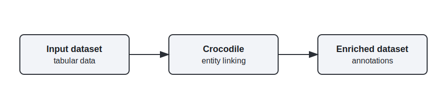

  <h1 style="margin:0 0 12px 0;">Crocodile</h1>
  

## **General Description**
Crocodile is a Python library that performs entity linking over tabular data to support dataset enrichment and annotation. It connects cell values to canonical entities or knowledge base entries, helping improve data quality and enabling downstream analytics on enriched datasets.

## **Related Compliance aspects**
- Data/AI pipeline step implementation for data enrichment

## **Main Goal/Functionalities**
- Entity linking on tabular data
- Automated dataset enrichment and annotation
- Improve annotation quality for downstream use

## **Architecture**
The picture below shows the component in the DATAPACT architecture.

## **Component Definition**
Crocodile links entity mentions in tabular fields to canonical entities or knowledge bases, enriching datasets with standardized identifiers and metadata. This supports evaluation workflows and improves annotation consistency and quality across representative data samples.

## **Screenshots**
n/a

## **Commercial Information**

| Organisation (s) | License Nature | License |
|------------------|----------------|---------|
| SINTEF | Open Source | Apache-2.0 |

## **Expected KPIs**

|What (types)|How(Process)|Values|
|------------|------------|------|
|Accuracy and usefulness of automated dataset enrichment and annotation|Evaluation on representative subsets of DATAPACT datasets, using expert review and comparison against baseline enrichment approaches without Crocodile|Crocodile-generated annotations should achieve at least 75% agreement with expert-reviewed annotations on evaluated samples, and demonstrate a minimum 10% relative improvement in annotation quality compared to baseline enrichment approaches|

## **Related Project Links**
| Project Links |
| ------------- |	
| Software GitHub Repository --> Crocodile software <https://github.com/enRichMyData/crocodile> |

## **How To Install**
See the external repository for installation instructions: <https://github.com/enRichMyData/crocodile>

### Detailed steps

See the external repository README and docs: <https://github.com/enRichMyData/crocodile>

## **How To Use**

See usage instructions in the external repository: <https://github.com/enRichMyData/crocodile>

## **Other Information**

n/a

## **OpenAPI Specification**

n/a

## **Additional Links**

n/a
